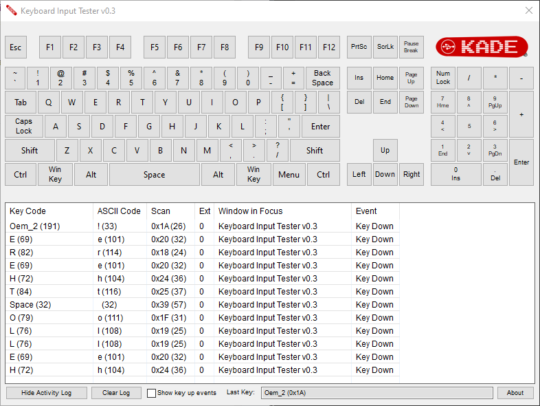

# **Keyboard Input Test Utility**
*by 10yard (a.k.a. Degenatrons), modified by DarthJahus*

A general purpose keyboard test utility which will echo pressed keys to a virtual on-screen
keyboard. Originally created for testing various keyboard layouts and encoders such as the KADE encoder,
it now focuses on ANSI (US) keyboard layouts using physical **Scan Codes** instead of logical Key Codes.

This fork introduces significant changes:

- Removed support for UK layouts — **ANSI only**
- Keys are mapped by **Scan Code** (hardware-level) instead of Key Code
- Activity log shows scan code in **hexadecimal**
- GUI cleaned up: removed text-to-speech, removed unused dropdowns
- The keyboard highlighter now correctly tracks **left/right modifier keys** via the `ext` flag
- App only hooks keyboard **when focused**, to avoid interfering with system usage

There is a detailed view of activity available by clicking on the "Show Activity Log" 
button. All inputs are displayed in a list and extensive information about keys is
reported including Key Code, ASCII code, and Scan Code (in hex).

To contribute or discuss the lack of scancode usage in gaming and software, join: [r/useScanCodes](https://reddit.com/r/useScanCodes)

---

## 📦 Downloads

All release binaries are on the [Releases page](https://github.com/DarthJahus/keyboardtester/releases).

---

## Version History

### v0.3.0.0 (Forked)
- Removed UK keyboard layout
- Switched to physical Scan Code mapping
- GUI cleaned up, removed text-to-speech and pinball
- More accurate highlighting using scan code + ext
- Input hook is only active when window is focused
- Scan Code is shown in hexadecimal in the activity log

### v0.2.0.0 - 08/08/2023
- Update sources to modern Python version
- Switch to pyWinHook package
- Fix icon bug
- Windows 32 and 64 bit builds

### Earlier versions (v0.1.x)
Legacy versions focused on encoder mapping, speech support, and layout selection.
Refer to [original repository](https://github.com/10yard/keyboardtester) for full history.
